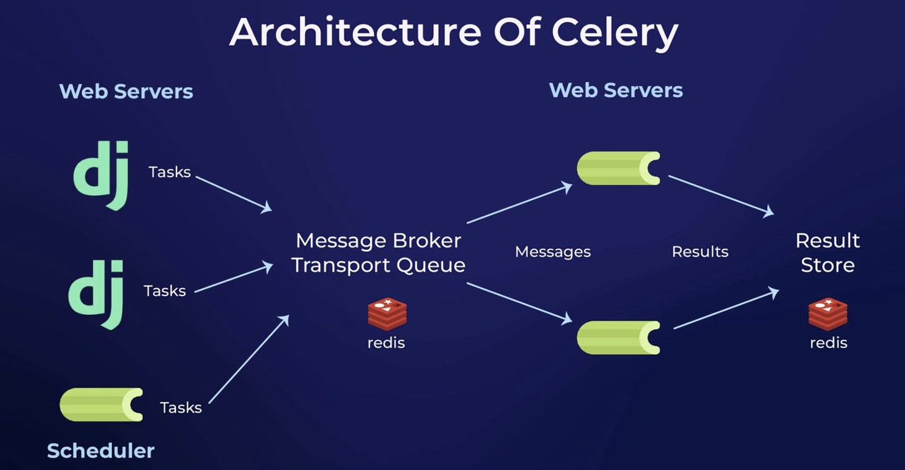
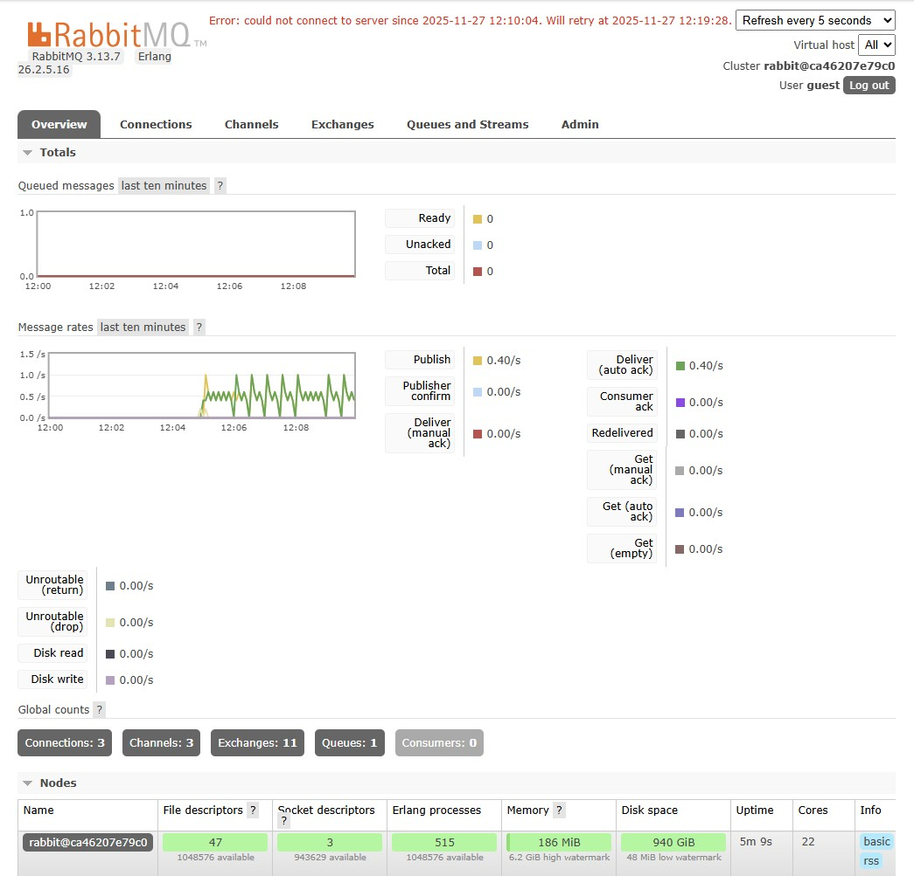
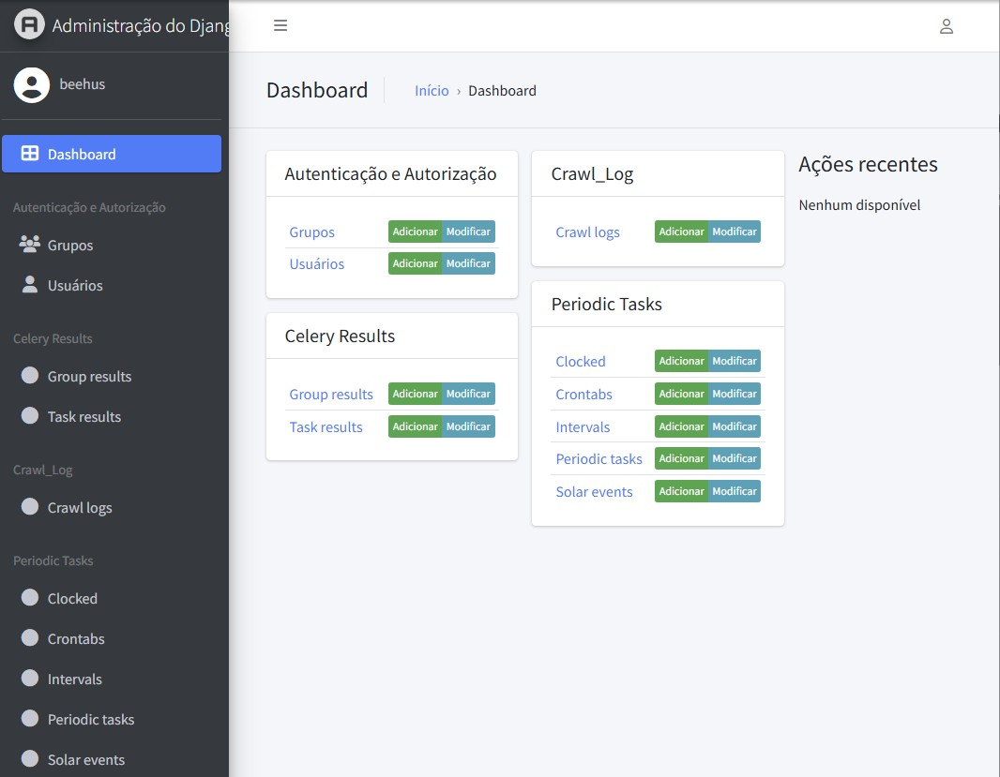

# Beehus

Um projeto Python com integração de **Celery** para processamento assíncrono de tarefas, **Selenium** para automação web e **Django** para gerenciamento de dados.

## 📋 Descrição

Este projeto automatiza fluxos de trabalho incluindo:

- **Automação Web**: Login automático em plataformas (JPMorgan Chase) usando Selenium WebDriver
- **Processamento Assíncrono**: Execução de tarefas em background com Celery
- **API REST**: Endpoints RESTful com Django e Django REST Framework
- **Agendamento**: Tasks recorrentes com django-celery-beat

Arquitetura:


## 🚀 Requisitos

- **Docker Desktop** (Windows e iOS)
- **Python 3.11+**
- **RabbitMQ** (broker AMQP)
- **Redis** (opcional, para cache/resultados)
- **Google Chrome** (para Selenium WebDriver)

## 📦 Instalação

### 1. Clone o repositório e configure o ambiente

```bash
# Criar ambiente Conda (recomendado)
conda create -n beehus python=3.11
conda activate beehus

# Clonar o repositório
git clone https://github.com/bomyoungkim-gmail/beehus-app.git
```

### 2. Instale as dependências

```bash
pip install -r requirements.txt
```

### 3. Configure as variáveis de ambiente

Alterar o arquivo `.env template` para `.env` na raiz do projeto:

```bash
# Renomear
mv ".env template" .env
```

Abrir o arquivo `.env` na raiz do projeto e substituir nome do usuario e a senha:
```env
JP_USERID=seu_usuario_jpmorgan
JP_PASSWORD=sua_senha_jpmorgan
```

### 4. Subir serviços

```bash
# Iniciar Build
docker-compose up --build

# Criar super usuario do Django
docker-compose exec web python manage.py createsuperuser
```

### 5. Parar serviços

# Para parar os containers

```bash
# Para os serviços mantendo os dados
docker-compose down

# ou Para parar os containers e remover os dados
docker-compose down -v
```

## 6. Tela de Administraçao dos serviços
```
# RabbitMQ
http://localhost:15672/#/
```


```
# Django
http://localhost:8000/admin/
```


## 🔧 Uso

### Iniciar o Worker Celery Manual

```bash
# Com multi-processing (padrão)
celery -A tasks worker --loglevel=info

# Com single thread (útil para desenvolvimento/debugging)
celery -A tasks worker --loglevel=info --pool=solo
```

## 📂 Estrutura do Projeto

```
beehus/
├── beehus_app            # Definição do aplicativo no Django
├── crawl_log             # Definição de tasks do aplicativo
├── manage.py             # CLI do Django
├── requirements.txt      # Dependências Python
├── .env                  # Variáveis de ambiente (não versionar)
├── .gitignore            # Arquivos a ignorar no Git
├── .dockerignore         # Arquivos a ignorar no Docker
├── docker-compose.yml    # Arquivos docker-compose
├── Dockerfile            # Arquivos Dockerfile
├── README.md             # Documentação do aplicativo
```

## 🔑 Tasks Disponíveis


## 📚 Dependências Principais

| Pacote | Versão | Uso |
|--------|--------|-----|
| celery | 5.5.3 | Processamento assíncrono |
| django | 5.2.8 | Framework web |
| selenium | 4.38.0 | Automação de browser |
| redis | 7.1.0 | Cache/resultados (opcional) |
| python-dotenv | 1.2.1 | Variáveis de ambiente |

Para a lista completa, veja `requirements.txt`.

## 📞 Suporte

Em caso de dúvidas ou erros, consulte a documentação oficial:

- **Celery**: https://docs.celeryproject.io/
- **Django**: https://docs.djangoproject.com/
- **Selenium**: https://www.selenium.dev/documentation/

## 📄 Licença

Este projeto é fornecido como está, sem garantias. Use por sua conta e risco.

---

**Última atualização**: 27 de novembro de 2025
